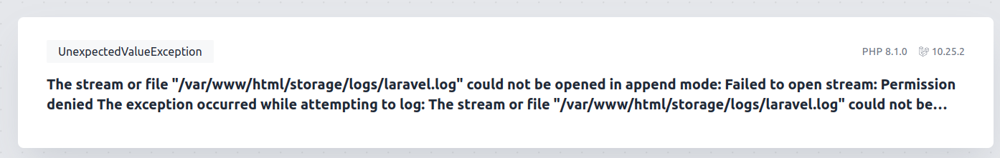
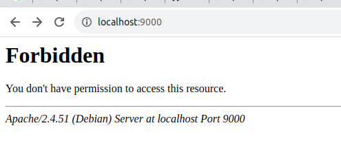

# Docker setup on Local for Laravel

[https://www.youtube.com/watch?v=V-MDfE1I6u0&ab_channel=AlimonPito](https://www.youtube.com/watch?v=V-MDfE1I6u0&ab_channel=AlimonPito)

**Setting up Docker**

- Clone these files[https://github.com/pitocms/laravel-docker/tree/main](https://github.com/pitocms/laravel-docker/tree/main) to local
- Run:  *sudo docker-compose build*
- Run: *sudo docker-compose up -d*
- Makefile works like: 


```
- sudo make setup
- sudo make build
- sudo make up
- sudo make stop
- sudo make composer-update
- sudo make data*
```

**Installing Laravel**

- To install Laravel into a director go to docker container and Run this command: 
 *sudo docker exec -it laravel-docker bash*
- And once you are in the container Run this command to install Laravel: 
*composer create-project laravel/laravel .*

**DB connection:**

- Go to Project .env file and update

```
DB_CONNECTION=mysql
DB_HOST=mysql_db (DB container name from docker-compose.yml)
DB_PORT=3306
DB_DATABASE=laravel_docker (DB name from docker-compose.yml)
DB_USERNAME=
DB_PASSWORD=
```

**Fixing Log files permission:**



Run: `sudo chmod o+w ./storage/ -R`

**Fixing Forbidden error:**



If you see Forbidden then add following .htaccess file to the root of the project

```
RewriteEngine On
RewriteCond %{REQUEST_URI} !^/public/
RewriteRule ^(.*) /public/$1 [L,QSA]
```
